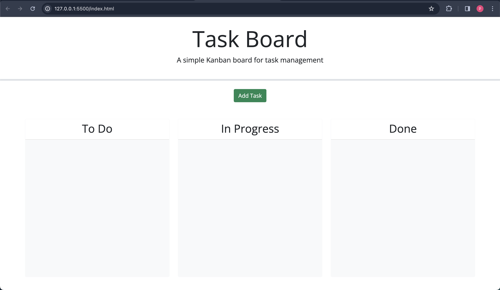
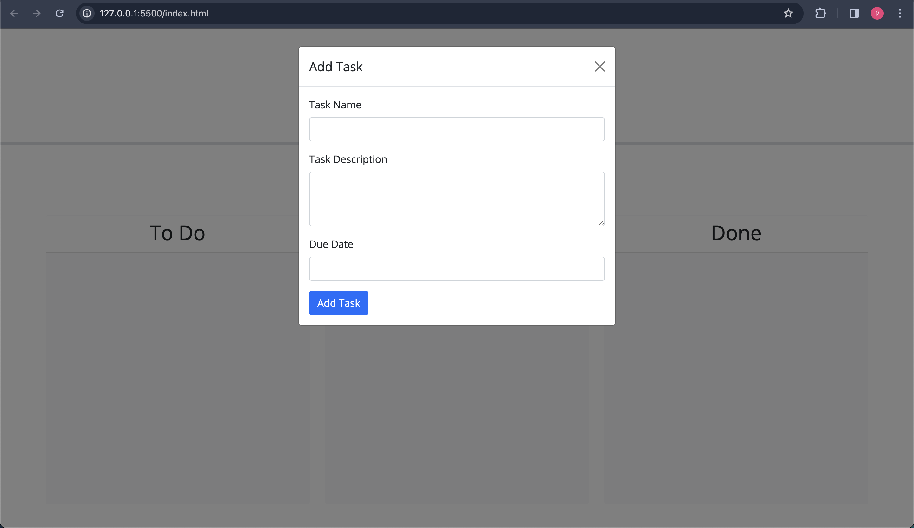
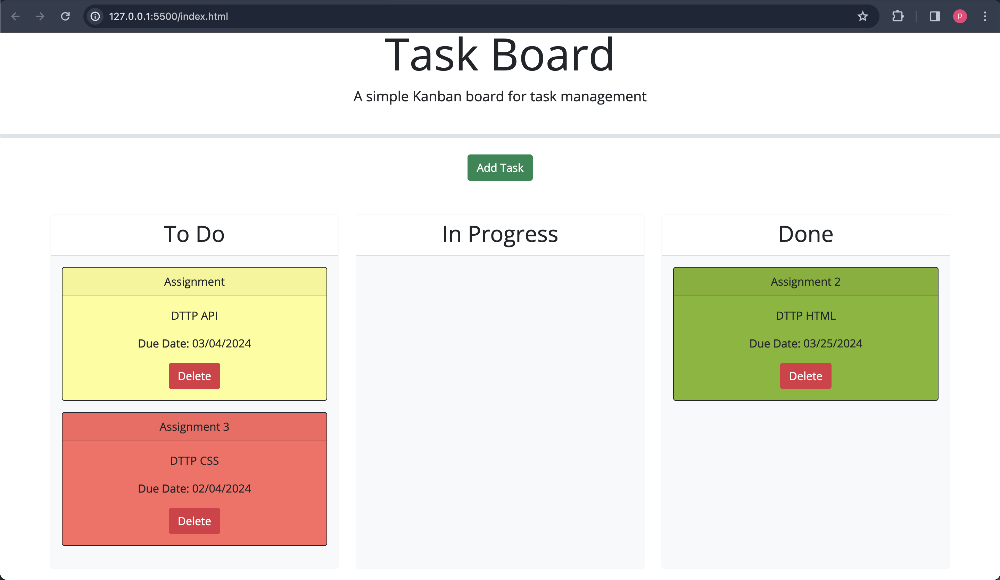
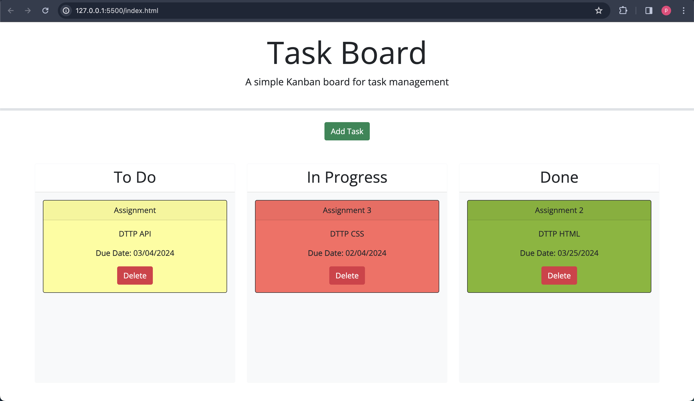

# Task Board Management System

The Task Board Management System is a web application designed to help users manage their project tasks efficiently. It provides a visual representation of tasks in different stages of completion, allowing users to track progress and prioritize work effectively.



## Features

- **Task Visualization**: Tasks are organized into columns representing different stages of completion, such as "To Do", "In Progress", and "Done".
- **Color-coded Deadline Indicator**: Tasks are color-coded to indicate their deadline status. Overdue tasks are highlighted in red, while tasks nearing their deadline are highlighted in yellow.

- **Drag-and-Drop Functionality**: Users can easily move tasks between columns by dragging and dropping them, reflecting changes in task status.

- **Modal Task Creation**: Users can create new tasks by filling out a form in a modal dialog, providing task name, description, and due date.

- **Persistent Data Storage**: Task data is stored locally using browser's localStorage API, ensuring that tasks persist even after refreshing the page.







## Technologies Used

- **HTML/CSS/JavaScript**: Frontend development using standard web technologies.
- **jQuery UI**: Used for drag-and-drop functionality and UI enhancements.
- **Bootstrap**: CSS framework for responsive design and styling.

## Usage

1. **Adding a New Task**: Click the "Add Task" button to open a modal dialog, then fill out the form with task details and click "Save".

2. **Managing Task Status**: Drag tasks between columns to update their status. Tasks can be moved from "To Do" to "In Progress" to "Done" columns.

3. **Deleting a Task**: Click the "Delete" button on a task card to remove it from the task board.

4. **Viewing Deadline Status**: Tasks are color-coded based on their deadline status for easy identification.

## Installation

1. Clone the repository to your local machine:

   ```
   git clone git@github.com:parthparmar24/TaskBoard.git
   ```

2. Open the project directory and launch the `index.html` file in a web browser.

## Contribution

Contributions are welcome! Feel free to submit bug fixes, feature enhancements, or other improvements via pull requests.

## License

This project is licensed under the MIT License - see the [LICENSE](LICENSE) file for details.

---

Feel free to customize the description based on your project's specific features and implementation details.
